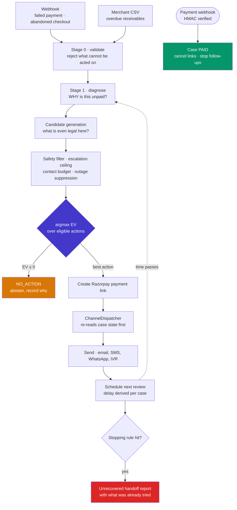
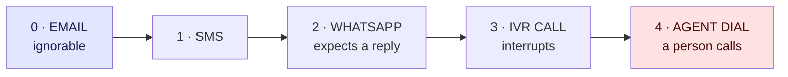

<div align="center">

# Unified Recovery Engine

### Find revenue that's slipping away, and win it back

**Razorpay AI Buildathon 2026 · Track 3 — AI Revenue Recovery**


One agent that detects revenue at risk across four streams, diagnoses why it is at risk,
decides what to do about it, and then **runs the recovery to completion on its own** —
escalating one rung at a time, timing its own reminders, stopping when it should,
and closing the case the moment the money arrives.

</div>

---

## Contents

| | |
|---|---|
| [See it work](#see-it-work) | The 60-second path for a reviewer |
| [The idea](#the-idea) | Why every contact is a number, not a rule |
| [How the loop runs](#how-the-loop-runs) | Detect, diagnose, decide, execute, follow up, stop |
| [The recovery workflow](#the-recovery-workflow) | Escalation ladder and derived reminder timing |
| [Measured results](#measured-results) | Money, contacts, and the verdicts |
| [What is real and what is simulated](#what-is-real-and-what-is-simulated) | Read before believing any number |
| [Running the live loop](#running-the-live-loop) | Real Razorpay, real email, real webhooks |
| [How it answers Track 3](#how-it-answers-track-3) | Clause by clause |
| [Architecture](#architecture) | Layout and decision records |

---

## See it work

```bash
make setup     # builds .venv with a supported Python, installs everything
make demo      # judge dashboard on http://localhost:8555
```

Then, in the dashboard:

| Tab | What it shows |
|---|---|
| **Decision trace** | One case from raw event to chosen action, every stage readable in one vertical flow |
| **Experiment** | Five arms, 4,000 cases, confidence intervals and verdicts |
| **Live test (CSV)** | Upload a receivables CSV and watch the engine decide per customer, on the case board |
| **Safety** | Invariants **executed live**, reporting real pass/fail — not a checklist |

```bash
make test      # 551 tests
make eval      # regenerates results/report.json + results/RESULTS.md
```

> **Not Python 3.14.** The pinned scientific stack has no wheels for it yet. `make setup`
> builds an isolated `.venv` with a supported interpreter, so it never matters what
> `python` points to globally. No `make`? Run `python scripts/bootstrap.py` instead.

---

## The idea

Most recovery today is a fixed rule: retry twice, then email, then call. The rule fires
whether or not it helps, and nobody can attribute a rupee to it.

This engine treats **every contact as a decision with a number attached**:

```
  Δ̂(x, a)  =  p̂(x, a)  −  p̂(x, NO_ACTION)         incremental effect of the action
  EV(x, a)  =  round(Δ̂ × amount_at_risk)  −  cost(a)   expected value, in paise
  choose    =  argmax EV over ELIGIBLE actions
```

`NO_ACTION` scores **exactly zero by construction**. So the engine abstains whenever no
contact clears the bar.

> **That abstention is the product.** It is what stops a recovery system becoming a
> harassment system, and it is the reason contact efficiency, not raw recovery rate, is
> where this engine earns its keep.

**Four streams, one engine:**

| Stream | Share of batch |
|---|---:|
| Failed payments | 40% |
| Abandoned checkouts | 30% |
| Failed subscription renewals | 18% |
| Overdue B2B receivables | 12% |

---

## How the loop runs



**Nothing external triggers the next step.** The engine schedules its own review, wakes
itself, re-reads the case, and decides again — until the money arrives or a stopping rule
ends it.

---

## The recovery workflow

### Escalation climbs one rung at a time



- The ceiling is always **`highest_confirmed_rung + 1`**. Never +2, whatever the score says.
- Only a contact **confirmed delivered** advances the ladder. A message that failed to send
  does not buy the right to phone someone.
- Escalation **creates no capacity**: a louder channel still consumes the same per-customer
  contact budget.

### Reminder timing is derived, not fixed

```
delay  =  base(diagnosis)  ×  multiplier(channel)  ×  backoff(attempt)
```

<table>
<tr><td valign="top">

**Base, by diagnosis**

| Diagnosis | Base |
|---|---:|
| Customer abandonment | 6h |
| Gateway failure | 8h |
| Card declined | 24h |
| Subscription renewal | 48h |
| Insufficient funds | 72h |
| Customer unresponsive | 120h |
| Invoice overdue | 168h |

</td><td valign="top">

**Multiplier, by channel**

| Channel | × | Why |
|---|---:|---|
| Machine retry | 0.5 | no human involved |
| SMS | 0.8 | read quickly |
| WhatsApp | 0.9 | |
| Email | 1.2 | unanswered ≠ ignored |
| IVR call | 1.5 | |
| Agent dial | 2.0 | do not crowd them |

</td></tr></table>

**Backoff:** `1.0 → 1.5 → 2.5 → 4.0`. Someone who ignored three messages will not answer
the fourth sooner.

> A gateway blip is retried in **~4 hours**. An overdue invoice is followed up in **~8 days**.
> Same engine, no per-case rules, no merchant configuration.

### Stopping is a first-class outcome

`4 follow-ups max` · `30-day recovery window` · `per-customer contact budget` ·
`quiet period between touches` · `suppression during a known gateway outage` ·
`abstention whenever nothing has positive EV`

### Two guarantees that matter most

> **Payment always wins.** Case state is re-read at the *moment of dispatch*, not when the
> action was queued. Money arriving cancels every pending message and every open payment
> link immediately. A customer who has paid cannot be chased by something already in flight.

> **What it cannot recover, it hands over honestly.** Everyone still unpaid once the ladder
> is exhausted is exported with what was already tried, so a human collections agent does
> not re-send the email the engine already sent three times.

---

## Measured results

From a 4,000-case batch (200 events × 20 seeds), regenerate with `make eval`:

| | |
|---|---:|
| **Money at risk** | ₹25,128,982 |
| **Attributed recovered** | **₹13,646,953** |
| **Value recovery rate** | **54.31%** |
| **Cost per recovery** | **3.54 paise** |
| **Total channel cost** | ₹76.80 |

### The verdicts, including the unflattering ones

| Comparison | Effect | 95% CI | p | Verdict |
|---|---:|---|---:|---|
| Engine vs doing nothing (A5 − CONTROL) | **+0.5423** | [0.5268, 0.5577] | 0.0000 | **SIGNIFICANT** |
| Primary (A2 − A1), recovery rate | −0.0148 | [−0.0365, 0.0070] | 0.1846 | INCONCLUSIVE |
| Model vs heuristic (A5 − A3) | +0.0005 | [−0.0213, 0.0223] | 0.9642 | INCONCLUSIVE |

**The ML model does not beat the transparent heuristic.** We pre-registered an experiment
predicting it would, once outcomes depended on context. **That prediction was falsified**,
and we report it rather than tuning it away.

### Where it does win, labelled for what it is

| Comparison | Contacts | Effect | 95% CI | p | Verdict |
|---|---:|---:|---|---:|---|
| A2 − A1, **contact rate** | 1,336 vs 1,500 | **−0.0410** | [−0.0619, −0.0201] | 0.000125 | **SIGNIFICANT** |

**10.9% fewer messages to customers, with no detectable loss of recovery.** The recovery
difference above is inconclusive, meaning its interval still contains zero; the contact
reduction is not.

**This comparison was not pre-registered, and that matters.** The registered primary is
recovery rate and it stays inconclusive; nothing here revises it. What predates the batch
is the design goal being tested, written down as *comparable recovery for materially fewer
customer contacts*. It is reported second, below the result that did not come out, because
a post-hoc metric shown first is a press release.

Recovery rate could never have shown this. A1 has no shared contact ledger, so it repeats
the first touch to everybody, while every control here can only ever **remove** a contact.
On a metric that rewards contacting more people, more safety can only look worse; beating
A1 there would have meant the controls were not binding.

Both halves are required before the engine claims a win, because contact rate on its own is
trivially gamed: CONTROL contacts nobody, scores a perfect reduction, and recovers nothing.
And "no detectable loss" is not proven equivalence, since no non-inferiority margin was
registered.

The finding is more interesting than a win would have been: **compliant escalation bounds
the action space so tightly that scorer quality is nearly irrelevant.** The two scorers
disagree on 4 of 1,000 decisions, and only 4 of 7 actions are ever chosen. Safety
constraints, not model cleverness, are doing the work — which is itself the result.

---

## What is real and what is simulated

Conflating these would be the dishonest direction, so they are separated everywhere.

<table>
<tr>
<th width="50%">🧪 The evaluation is simulated</th>
<th width="50%">✅ The live path really sends</th>
</tr>
<tr>
<td valign="top">

Every number in `results/RESULTS.md` comes from a deterministic local simulator.
Interventions, customer responses and outcomes are **authored, not observed**.

Confidence intervals quantify sampling error *inside the simulation only*. They say
nothing about distance from a real-world value.

**No claim of real-world Razorpay recovery uplift is made or supported.**

</td>
<td valign="top">

With dispatch explicitly enabled, the engine creates **real Razorpay Payment Links**, sends
a **real email**, receives **real HMAC-verified webhooks**, and closes the case when money
arrives.

Run end-to-end with a real **₹25,000** test-mode payment.

What that proves is that **the loop closes** — not that recovery rates improve.

</td>
</tr>
</table>

**Dispatch is off by default.** Two independent gates must both open (`--send` **and**
`RECOVERY_DISPATCH_ENABLED=true`) before anything leaves the process, and the test suite
forces both closed for the whole session, so a test run can never contact anyone.

---

## Running the live loop

> ⚠️ This actually contacts people. Use a CSV containing only addresses you own.

```bash
cp .env.example .env     # fill in Razorpay TEST keys and SMTP credentials
```

**Three terminals:**

```bash
# 1 · webhook server — receives Razorpay's signed events
.venv/Scripts/python.exe -m app.api.webhook_listener

# 2 · public tunnel — reads NGROK_DOMAIN from .env, nothing to substitute
./scripts/start_tunnel.ps1

# 3 · the demo — CSV → decision → link → email → wait for payment
.venv/Scripts/python.exe scripts/run_demo_a.py --csv demo_customers.csv --send
```

Register `https://<your-domain>/webhooks/razorpay` in Razorpay Test Mode **once**. Paying
the link fires the webhook and the case closes itself:

```
CASE_CREATED          Case opened for Rs 25,000.00
AGENT_DECIDED         Agent selected EMAIL_LINK
PAYMENT_LINK_CREATED  Payment link created
MESSAGE_SENT          EMAIL_LINK sent via EMAIL_SMTP
FOLLOWUP_SCHEDULED    Next review 2026-09-14
PAYMENT_RECEIVED      Payment received of Rs 25,000.00
CASE_CLOSED           Case closed - payment verified. All pending contact cancelled.
```

**Diagnosing a silent failure:** `scripts/send_test_webhook.py` exercises the entire
receiving path (tunnel, HMAC, replay window, idempotency, event mapping, case resolution)
without needing a payment. If that works and a real payment does not, the problem is the
dashboard registration, not the code.

---

## How it answers Track 3

> *"Build an agent that detects revenue at risk, determines the right intervention, and
> executes a bounded recovery workflow."*
> *The bar: measured money recovered across a batch, with compliant escalation, stopping
> rules, and an audit trail.*

| Clause | Where |
|---|---|
| build an **agent** | `app/agent/loop.py` — decides, executes, schedules its own next review |
| detects revenue at risk | Stage 0 validation + Stage 1 diagnosis (`app/pipeline/`) |
| determines the right intervention | candidate generation → EV ranking → arbitration (`app/scoring/`) |
| **executes** a bounded workflow | `app/dispatch/` — real links, real email, real webhooks |
| payment failures / checkout / receivables | mixed-stream batch (`app/experiment/batch.py`) |
| **measured money across a batch** | 4,000 cases against a ≥200 floor — `results/RESULTS.md` |
| **compliant escalation** | `app/pipeline/escalation.py` (ADR-0015) |
| **stopping rules** | contact cap · quiet period · escalation ceiling · outage suppression · abstention |
| **audit trail** | case timeline · contact ledger · dispatch log · per-decision correlation trace |
| ₹ recovered vs ₹ at risk, rate, cost per recovery | the Money table in `results/RESULTS.md` |

### One distinguishing piece

Overdue B2B receivables have their **TDS withholding *derived*** from the invoice's own
facts — section, payee constitution, PAN presence, amount remitted — rather than read off a
flag. The s.206AA no-PAN 20% floor and s.288B rounding tolerance are applied in basis
points.

So the engine **declines to chase a shortfall that is simply statutory withholding** the
payer already remitted to the government. Chasing it would be both wrong and the fastest
way to lose a B2B customer. See `app/pipeline/tds.py` and ADR-0016.

---

## Architecture

```
app/
├── pipeline/        Stage 0/1, candidate generation, safety filter, escalation, TDS
├── scoring/         heuristic + CatBoost S-learner, EV calculator, cost schedule
├── ledger/          concurrency-safe contact ledger (atomic reservation)
├── orchestration/   end-to-end closed-loop orchestrator
├── experiment/      arm policies, batch generator, statistical runner
├── agent/           the autonomous cycle: decide, execute, schedule the next review
├── cases/           durable case, CSV ingest, repository, case board
├── dispatch/        channel adapters, copy, HTML email, the dispatcher gate
├── payments/        Razorpay payment link lifecycle
├── realtime/        webhook ingestion, live downtime, follow-up queue, reliability
├── reporting/       unrecovered handoff export
├── api/             signed webhook listener
└── ui/              Streamlit judge dashboard

scripts/
├── bootstrap.py           one-command venv setup
├── run_evaluation.py      produces results/report.json + RESULTS.md
├── run_demo_a.py          the live CSV-to-payment demo
├── send_test_webhook.py   signed webhook probe
└── start_tunnel.ps1       public tunnel for Razorpay callbacks
```

**76 modules · 15,070 lines · 551 tests · 25 architecture decision records**

### Decision records

Every significant call is recorded in [`refer/decisions/`](refer/decisions/ADR_INDEX.md),
including the ones that did not go our way. Some worth reading:

| ADR | Decision |
|---|---|
| [0015](refer/decisions/ADR-0015-compliant-escalation-ladder.md) | Compliant escalation ladder, layered **under** safety, never over it |
| [0016](refer/decisions/ADR-0016-tds-derivation-over-declared-flag.md) | TDS derived from invoice facts, not a declared flag |
| [0020](refer/decisions/ADR-0020-context-dependent-dgp.md) | Context-dependent DGP — **prediction falsified**, reported as-is |
| [0023](refer/decisions/ADR-0023-durable-case-and-payment-resolution.md) | A durable case, and payment always wins |
| [0026](refer/decisions/ADR-0026-thin-agent-loop.md) | The agent loop is thin, and runs the **evaluated** engine |
| [0027](refer/decisions/ADR-0027-case-board-reports-delivery-not-readership.md) | The board reports delivery and payment, **never readership** |

---

## Deployment

`render.yaml` deploys the **dashboard** to Render. The webhook listener deliberately is
**not** deployed there.

Render's free instances have an ephemeral filesystem and spin down after 15 minutes without
traffic. The recovery loop closes when a customer pays *on Razorpay's site*, which sends no
traffic to the service — so the instance would sleep during exactly the gap that matters,
the SQLite file would be wiped, and the payment webhook would arrive to find no case to
close. The demo would fail at its most important moment, silently.

Hosting the full loop needs a paid instance with a disk mounted at `/var/data`.

---

<div align="center">

*Every figure in `results/` describes an authored simulation. The live path really sends,
but proves only that the loop closes.*
**No claim of real-world Razorpay recovery uplift is made or supported.**

</div>
