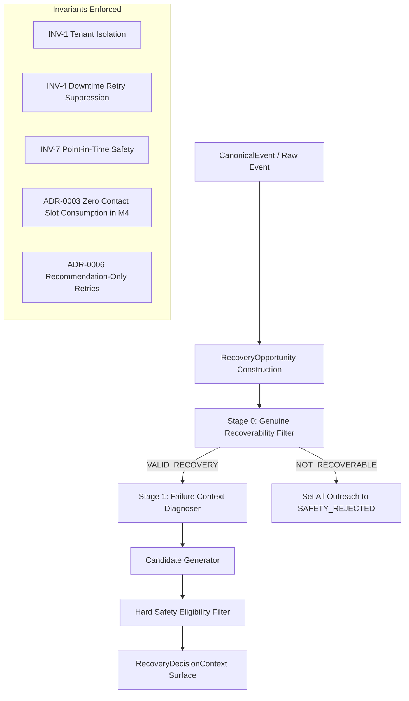

# HANDOFF M4 → M5 — RECOVERY PIPELINE TO AI SCORER ENGINE

**Version**: 1.0.0
**Date**: 2026-09-01
**Author**: Unified Recovery Engine Build Team
**Status**: VERIFIED & READY FOR M5

---

## 1. Executive Summary

Milestone M4 (**Recovery Pipeline & Candidate Generators**) is **COMPLETED**, fully verified, and ready to serve as the deterministic upstream foundation for Milestone M5 (**AI Scorer & Counterfactual Policy Engine**).

M4 transforms canonical revenue events into validated recovery opportunities, structured failure diagnoses, and a hard-safety-filtered pool of action candidates.

---

## 2. Verified Invariants & Principles



| Invariant / Decision | Enforcement Mechanism in M4 |
|---|---|
| **INV-1 Tenant Isolation** | `merchant_id` required on all pipeline operations; cross-tenant DAL operations raise `TenantScopeViolation`. |
| **INV-4 Outage Suppression** | Gateway downtime status automatically sets Stage 1 diagnosis to `GATEWAY_FAILURE` and marks all retries/outreach `SAFETY_REJECTED` with `KNOWN_GATEWAY_OUTAGE`. |
| **INV-7 Point-in-Time Safety** | Stage 0 verifies `observed_at <= decision_timestamp`. Future observed timestamps raise `PointInTimeLeakageError`. |
| **ADR-0003 Budget Boundary** | Candidate generation does **NOT** reserve or consume contact slots. `is_contact_reserved` is explicitly `False`. |
| **ADR-0006 Retry Ownership** | Retries are strictly generated as `RECOMMEND_RETRY` recommendations. No direct payment execution occurs. |
| **Mandatory Counterfactual** | Candidate #1 in every generated candidate set is **ALWAYS** `NO_ACTION` (`is_counterfactual=True`, `eligibility=ELIGIBLE`). |

---

## 3. Core Interface Contracts for M5

### 3.1 Pipeline Entrypoint

```python
from app.pipeline.recovery_pipeline import RecoveryPipeline

pipeline = RecoveryPipeline(db=tenant_scoped_db, downtime_provider=downtime_provider)
context = pipeline.process_raw_event(raw_event_dict, decision_timestamp="2026-09-01T10:00:00+00:00")
```

### 3.2 Hand-off Surface (`RecoveryDecisionContext`)

```python
@dataclass(frozen=True)
class RecoveryDecisionContext:
    opportunity: RecoveryOpportunity
    stage0_result: Stage0Result
    diagnosis: DiagnosisResult
    candidates: List[ActionCandidate]
    decision_timestamp: str
    feature_snapshot: Dict[str, Any]
    provenance: DataProvenance
    is_contact_reserved: bool = False  # Always False in M4

    def get_eligible_candidates(self) -> List[ActionCandidate]:
        """Return subset of candidates eligible for M5 scoring/arbitration."""
        return [c for c in self.candidates if c.is_eligible]
```

### 3.3 Candidate Action Contract (`ActionCandidate`)

```python
@dataclass(frozen=True)
class ActionCandidate:
    action_type: ActionType
    eligibility: EligibilityStatus  # ELIGIBLE or SAFETY_REJECTED
    reject_reason: SafetyRejectReason
    reason_explanation: str
    evidence: Dict[str, Any]
    is_counterfactual: bool = False
```

---

## 4. Standardized Golden Scenarios (S001..S010)

The pipeline is verified against 10 standardized golden scenarios defined in `app/pipeline/scenarios.py`:

- **S001**: Genuine failed payment (INSUFFICIENT_FUNDS, all channels eligible).
- **S002**: Self-cured payment (Stage 0 NOT_RECOVERABLE, reason SELF_CURED).
- **S003**: Gateway outage (Stage 1 GATEWAY_FAILURE, candidates SAFETY_REJECTED with KNOWN_GATEWAY_OUTAGE).
- **S004**: Abandoned checkout (Stage 1 CUSTOMER_ABANDONMENT).
- **S005**: Failed subscription renewal (Stage 1 SUBSCRIPTION_RENEWAL_FAILURE).
- **S006**: Overdue B2B invoice (Stage 1 INVOICE_OVERDUE, generates IVR_CALL & AGENT_DIAL).
- **S007**: Duplicate event (Stage 0 NOT_RECOVERABLE, reason DUPLICATE_EVENT).
- **S008**: Cross-tenant identical customer (Separate isolated evaluations).
- **S009**: Budget exhausted (Outreach actions SAFETY_REJECTED with CONTACT_BUDGET_UNAVAILABLE, NO_ACTION eligible).
- **S010**: High-value opportunity (Multiple eligible candidates for arbitration).

---

## 5. Explicit Guidance for the M5 Developer / Agent

When building **Milestone M5 (AI Scorer & Policy Engine)**:

1. **Do NOT filter candidates in M5**: Consume `context.get_eligible_candidates()`. If a candidate is `SAFETY_REJECTED`, M5 **must never override** its status.
2. **Always score `NO_ACTION`**: M5 must compute recovery probability and expected value for `NO_ACTION` as the baseline.
3. **Atomic Reservation at Decision Handoff**: M5 selects the optimal action. If the chosen action is a customer outreach channel, M5 must invoke `ContactLedgerEngine.reserve_contact_slot()` before dispatching the intervention.
4. **Maintain Determinism**: Given identical `RecoveryDecisionContext`, M5 scoring and arbitration must produce deterministic results.
