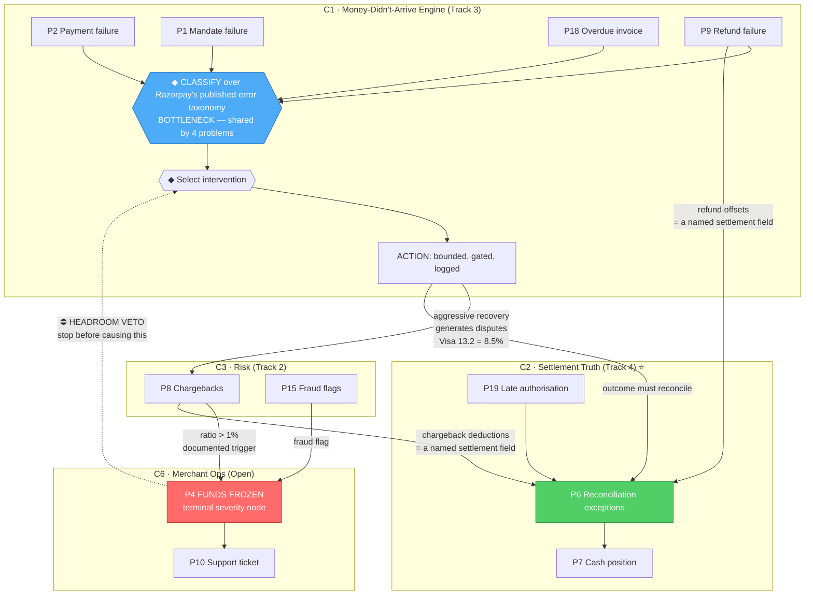

# connected_problem_graph.md — Phase 12: The Connected Problem Graph

Compiled 2026-08-25. Final synthesis of [problem_graph.md](problem_graph.md) (edges),
[problem_clusters.md](problem_clusters.md) (grouping), [agentic_opportunities.md](agentic_opportunities.md)
(agent design) and [competition_analysis.md](competition_analysis.md) (where differentiation lives).

**Legend used throughout**

```
  ↓ / →   flow            ◆ AI decision point         ⚙ tool call (real MCP tool)
  ⛔ guard / stopping rule  ⭐ India-specific wedge      ⟲ learning loop
  📊 measurable outcome     ⚠️ known constraint
```

---

## GRAPH 1 — Cluster C2 · Reconciliation Exception Resolution ⭐ *the recommendation*

```
BUSINESS PROBLEM
Merchants spend 20-40 finance work-hours/month reconciling by hand   [Razorpay's own figure]
      ↓
SUBPROBLEM
Settlement lines carry MDR, GST-on-MDR, refund offsets, chargeback
deductions, net settled and bank UTR — and a share of them don't match
      ↓
CONNECTED SUBPROBLEMS ─────────────────────────────────────────────────┐
  • P19 late authorisation  → status finalises minutes-hours later     │
  • P9  refund offsets      → a named field inside the settlement line │
  • P8  chargeback deducts  → a named field, landing a cycle LATER     │
  • Multi-PSP fragmentation → competitor exports, no shared schema     │
      ↓                                                                │
⚙ fetch_all_settlements · fetch_settlement_recon_details               │
⚙ fetch_all_payments · fetch_all_refunds · bank-statement parser       │
      ↓                                                                │
DETERMINISTIC MATCH PASS  (amount / date / UTR, tolerance windows)     │
      ↓                                                                │
   ┌──────────────┴───────────────┐                                    │
matched (~92-98%)          RESIDUAL QUEUE  ← the actual work           │
   ↓                              ↓                                    │
   │                    ◆ AI DECISION 1 — classify the break           │
   │                      missing UTR · net-only reporting ·           │
   │                      cross-period deduction · late auth ·         │
   │                      partial refund · fee/GST rounding ⭐         │
   │                              ↓                                    │
   │                    ◆ AI DECISION 2 — generate candidates          │
   │                      and score evidence for each                  │
   │                              ↓                                    │
   │                    ◆ AI DECISION 3 — propose or abstain?          │
   │                              ↓                                    │
   │            ┌─────────────────┴──────────────────┐                 │
   │      confidence ≥ θ                   confidence < θ              │
   │            ↓                                    ↓                 │
   │   ACTION: write PROPOSAL              ACTION: emit EXCEPTION      │
   │   (+ evidence chain, + confidence)    (+ candidates considered,   │
   │            ↓                           + discriminating evidence  │
   │   ⛔ GUARD: writes to a proposals        that was missing)         │
   │      table, NEVER to the ledger.        ↓                         │
   │      Never asserts finality —        ranked by MATERIALITY        │
   │      the exact liability that                ↓                    │
   │      stopped Razorpay shipping       human reviews the tail only  │
   │      a resolver ⭐                            ↓                    │
   └────────────┴────────────────────────────────┬─┘                   │
                ↓                                 │                    │
        HUMAN: accept / reject / amend            │                    │
                ↓                                 │                    │
📊 MEASURABLE OUTCOME                             │                    │
   • match rate on a held-out batch (≥500 rows)   │                    │
   • PROPOSAL PRECISION  ← the real failure mode  │                    │
   • exception count + composition                │                    │
   • throughput (records/min)                     │                    │
   • sensitivity curve across a 2-10% tail share  │                    │
   • hours saved = H × tail share × resolution rate                    │
                ↓                                                      │
⟲ LEARNING LOOP: rejected proposals → tighten θ, refine the break      │
  taxonomy, add candidate-generation rules ─────────────────────────────┘
```

**⭐ Where the differentiation sits:** Ledge and HighRadius reconcile generically for US/EU rails.
Nothing reasons about **GST-on-MDR, TDS, and Indian cross-period settlement cycles** as Razorpay
itself specifies them.

---

## GRAPH 2 — Cluster C1 · The Money-Didn't-Arrive Engine

**One loop, four ledgers.** The classification stage is identical; only the intervention policy
differs.

```
BUSINESS PROBLEM
An expected movement of money did not happen
      ↓
   ┌──────────┬───────────────┬──────────────┬────────────────┐
 P2 payment   P1 mandate      P9 refund      P18 invoice
 failed       failed          failed         overdue
 (4-8% of     (~70% of SBI    (top complaint (73-day DSO vs
  UPI attempts) auto-debits)   category)      45-day norm)
   └──────────┴───────┬───────┴──────────────┴────────────────┘
                      ↓
        ⭐ SHARED BOTTLENECK — the graph's highest-leverage component
        ◆ AI DECISION 1 — classify WHY, over Razorpay's PUBLISHED taxonomy
          bank_technical_error · insufficient_funds · payment_declined ·
          payment_timed_out · vpa_resolution_failed · invalid_vpa …
          + the `source` enum: bank / gateway / customer / issuer
          ⚙ published reason → next-best-action mapping (Razorpay ships
            the table and ships nothing that executes it)
                      ↓
        ◆ AI DECISION 2 — recovery probability, and WILL IT SELF-CURE?
          ⚠️ nobody publishes a self-cure rate. Gross recovery without a
             holdout overstates the effect — possibly by two-thirds
                      ↓
        ◆ AI DECISION 3 — optimal intervention
          transient (timeout 35-45%) → retry now
          funding  (insufficient 15-25%) → time it to predicted balance ⭐
          credential (wrong PIN 20-30%) → re-auth / new mandate
          receivable → prioritised, compliant chase
                      ↓
        ⛔ GUARD — HEADROOM VETO  (the design's centrepiece)
           project the merchant's chargeback ratio forward.
           Visa 13.2 "cancelled recurring" = 8.5% of all chargebacks,
           and Razorpay freezes above 1% — STRICTER than Visa VAMP's 1.5%.
           ⭐ stopping rule = stop before YOUR OWN recovery pushes the
              merchant into a freeze
                      ↓
           ┌──────────┴───────────┐
        proceed                 halt → escalate to merchant
           ↓
        ACTION (bounded, gated, logged, idempotent)
        ⚙ create_payment_link / create_payment_link_upi
        ⚙ send_payment_link · create_registration_link · fetch_tokens
        ⛔ attempt caps · quiet hours · no rail switch without a mandate
           for that rail · idempotency keys (double-debit risk is real)
                      ↓
        VERIFY  ⚙ fetch_payment / fetch_all_payments
                      ↓
        RECONCILE THE OUTCOME ──────────→ feeds GRAPH 1 (P9/P19 edges)
                      ↓
📊 MEASURABLE OUTCOME
   • ⭐ INCREMENTAL ₹ recovered vs holdout — never gross
   • recovery rate by failure class
   • cost per recovery attempt
   • ⛔ chargeback ratio held below the freeze trigger (constraint metric)
   • DSO days compressed (P18 branch)
                      ↓
⟲ LEARNING LOOP: outcome by (failure class × timing × channel) → update
  the timing model and the intervention policy; recompute self-cure baseline
```

**⚠️ Phase 11 correction:** Revaly/FlexPay already ships decline-code-driven retry timing
commercially. What remains unoccupied is the **UPI AutoPay/e-NACH lifecycle**, the **RBI 24-hour
pre-debit notification window**, and the **headroom veto**.

---

## GRAPH 3 — Cluster C4 · Agentic Commerce Trust

```
BUSINESS PROBLEM
An AI buyer transacts on a merchant — and nobody can prove it bought
what the human actually meant
      ↓
SUBPROBLEM                                CONNECTED SUBPROBLEM
Consent is AMOUNT-scoped, not         ⟵→  No dispute or liability path
INTENT-scoped (UPI Reserve Pay:            exists for AI-led transactions
one-time consent, per-merchant             (UAP unlaunched; NPCI will
cap ~₹10,000, instant revoke) ⭐            authenticate agents but NOT
                                           track purchase specifics)
      ↓
human instruction ──→ agent shops ──→ cart assembled
                          ⚙ catalog · create_order · fetch_order
      ↓
◆ AI DECISION 1 — does the cart match the stated intent?
  item · quantity · substitution · price drift · recurring-vs-one-off
  ⚠️ documented failure: OpenAI's Instant Checkout stumbled on product-data
     accuracy with Etsy, Walmart, Shopify — "right price, wrong product"
      ↓
◆ AI DECISION 2 — is divergence material or benign?
      ↓
   ┌──────────────┴────────────────┐
 within intent              divergence detected
   ↓                                ↓
⛔ GUARD: cap check          ACTION: block capture, surface the diff,
   before capture                    ask the human
   ⚙ capture_payment                 ↓
   ↓                          ⟲ human confirms or corrects
📊 MEASURABLE OUTCOME
   • divergence detection precision / recall on labelled + adversarial pairs
   • capture-blocked rate and false-block rate
   • auditable consent → instruction → cart → payment chain
      ↓
⟲ LEARNING LOOP: confirmed/corrected divergences → refine the intent model
```

**⭐ Wedge:** Visa TAP, Mastercard Verifiable Intent and Google UCP/AP2 are all forming — **none
addresses UPI Reserve Pay**, which is the consent model actually live in India.

---

## GRAPH 4 — Cluster C6 · Merchant Freeze Navigation ⚠️ *eliminated on data*

```
P8 chargeback >1% ─┐
P15 fraud flag ────┼──→ ⭐ P4 MERCHANT FUNDS FROZEN ──→ P10 support ticket
P17 stale KYC ─────┤     (2-5 days / 1-3 weeks / 30+ days;
P13 PA compliance ─┘      120-day case documented)
                              ↓
                   ◆ which trigger most likely applies?
                   ⛔ NEVER claims to know why Razorpay froze it —
                      AML tipping-off legitimately prevents disclosure ⭐
                              ↓
                   ACTION: assemble document pack · track vs published
                   bands · draft written-reason request · draft escalation
                   · draft Ombudsman complaint · project payroll risk
                              ↓
📊 time-to-submission · first-submission completeness · frozen-capital days
                              ↓
                   ⚠️ ⛔ NO FEEDBACK LOOP EXISTS
                      You cannot observe whether funds were released faster.
                      Holds cannot be created in test mode. No hold API.
```

**Verdict: highest novelty in the corpus (9), near-zero competition (2), and eliminated in Phase 9.**
Kept in the graph because it explains the terminal node — but do not build it.

---

## GRAPH 5 — The master graph (cross-cluster)



**Text equivalent of the master graph:**

```
                    ┌──────────────────────────────────────────┐
                    │  ◆ CLASSIFY (published error taxonomy)   │ ← BOTTLENECK
                    │    shared by P1 · P2 · P9 · P18          │
                    └───────────────────┬──────────────────────┘
                                        ↓
                              ◆ select intervention  ←──────┐
                                        ↓                    │
                                    ACTION                   │ ⛔ headroom veto
                          ┌─────────────┼─────────────┐     │
                          ↓             ↓             ↓     │
                 recovery outcome   disputes     reconcile   │
                          │        (Visa 13.2      ↓         │
                          │         = 8.5%)        │         │
                          │             ↓          │         │
                          │      chargeback ratio  │         │
                          │             ↓          │         │
                          │        >1% trigger ────┼─────────┘
                          │             ↓          │
                          │      ⭐ P4 FROZEN      │
                          │       (terminal)       │
                          │             ↓          │
                          │      P10 support       │
                          ↓                        ↓
                 📊 incremental ₹        📊 match rate + exceptions
```

---

## Graph properties — final

| Property | Finding |
|---|---|
| **Strongest node** | ⭐ **The classification step** over Razorpay's published error taxonomy. It is the first stage of four different agents (P1, P2, P9, P18), it is fully specified by public documentation, and Razorpay ships the reason→action table **but nothing that executes it** |
| **Most valuable edge** | **P8 → P4** (chargeback ratio > 1% → funds frozen). It converts a 0.26%-rate nuisance into a total revenue stop, and it is the only edge where an agent optimising its own metric can cause the graph's worst outcome |
| **Biggest bottleneck** | Same as the strongest node. Solve classification once and C1 and C2 both unlock |
| **Terminal severity node** | **P4** — four upstream problems converge, and revenue *stops* rather than degrades |
| **Convergence node** | **P6** — every transaction outcome must eventually appear as a settlement line; chargebacks and refunds are literally fields in the artefact |
| **Sink** | **P10 support** — highest in-degree, no independent data, poor build target |
| **Trade-off edge** ⚡ | **P11 ⚡ P16** — cutting RTO by forcing prepaid raises checkout abandonment. Opposed outcomes on the same screen |
| **Weak edges removed** | P3↔operations, P14↔anything, P12↔P2, P16↔P6, P10↔P5, P17↔P2, P11↔P1 (7 removed as weak or artificial) |

---

```
PHASE 12 VALIDATION

Strongest node:
  The failure-classification step over Razorpay's published error taxonomy (10 UPI codes, card
  codes, the enumerated `source` field, and the reason -> next-best-action spreadsheet). It is
  the first stage of four separate agents, it is fully specified by public documentation, and
  Razorpay publishes the mapping while shipping nothing that executes it.

Most valuable edge:
  P8 -> P4. Chargeback ratio above 1% is Razorpay's own documented freeze trigger - stricter
  than Visa VAMP's 1.5% and Mastercard ECM's 1.5%. This edge turns a low-rate problem into a
  catastrophic one, and it is the only edge in the graph where an agent optimising its assigned
  metric can trigger the worst outcome for the merchant it serves.

Biggest bottleneck:
  Classification. Building it once unlocks C1 (recovery across four ledgers) and feeds C2
  (exception typing). It is also the single most reusable component and the cheapest to
  evidence, because the ontology is published.

Weak edges removed (carried from Phase 4, unchanged):
  P3 <-> operational problems (shares the word "revenue" only)
  P14 <-> anything (corporate finance)
  P12 <-> P2 (vocabulary overlap, different rails)
  P16 <-> P6 (an abandoned cart never becomes a settlement line)
  P10 <-> P5, P17 <-> P2, P11 <-> P1

Most powerful end-to-end workflow:
  DETECT -> CLASSIFY (shared taxonomy) -> DECIDE intervention -> CHECK HEADROOM (veto) ->
  ACT within bounds -> VERIFY -> RECONCILE the outcome -> UPDATE cash position -> LEARN.

  It spans Graph 2 and Graph 1, joined at the reconciliation step, and it is the only workflow
  in the corpus that satisfies TWO track bars simultaneously: Track 3's "measured money
  recovered across a batch, with compliant escalation, stopping rules, and an audit trail" and
  Track 4's "match rate and the exceptions it could not resolve".

  Practical caveat: you submit under ONE track. Build the full loop, submit under the track
  whose bar your primary metric answers - Track 4 if the headline number is match rate,
  Track 3 if it is incremental rupees recovered.

Confidence: 8/10

READY FOR PHASE 13: YES
```

**Why 8/10.** Every edge drawn here survived the four-test screen in Phase 4, seven were removed, and
the two structural claims that carry the most weight — the shared classification bottleneck and the
P8→P4 freeze edge — rest on published Razorpay artefacts rather than on inference. It is not 9/10
because the graph's *shape* is a modelling choice: a different analyst could reasonably centre it on
the settlement line rather than on the classification step, and would get a defensible but different
picture.
